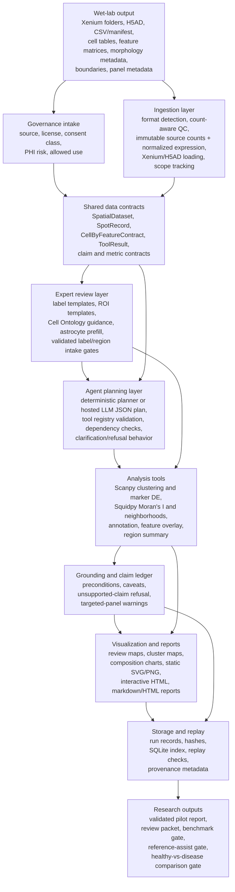

# SpatialMind

This repository implements SpatialMind, an agentic spatial omics analysis system that converts biological questions into validated local workflows. The current active product path is a Xenium pilot agent: it can ingest real wet-lab platform outputs after instrument processing, prepare expert-review templates, run gated MVP analyses, generate comprehensive reports, and refuse validated biological claims until expert cell labels and user region labels are supplied.

1. Data ingestion
2. Algorithm engine
3. LLM-style reasoning and planning
4. Visualization
5. Memory
6. Storage and provenance

The base path remains dependency-light for fast testing, while the core workstation environment in `requirements.txt` enables real H5AD/Xenium ingestion and Scanpy/Squidpy-backed wrappers. PyTorch-based scVI/cell2location packages live in `requirements-deep-learning.txt` and must be installed in a separate environment to avoid mixed OpenMP runtimes on Intel macOS.

## Architecture

**New here? Read [docs/agent_architecture.md](docs/agent_architecture.md)** — the single end-to-end
explanation of how the agent works: every stage from the `.xenium` bundle through the gate, the seven
MVP tools, robustness, claim reliability, and the Explorer-lite viewer. The rest of this README is a
command reference.



Layer responsibilities:

- **Wet-lab input layer** receives instrument/software outputs, not primary sequencing basecalls. Today this means Xenium output folders, H5AD/AnnData files, tidy CSV tables, and manifest JSON.
- **Governance layer** records dataset source, license, consent/PHI status, and allowed use before data becomes reusable.
- **Ingestion layer** converts raw platform outputs into one internal `SpatialDataset`. Each cell keeps immutable source values in `raw_genes` and normalized/log-transformed analysis values in `genes`; count-aware QC uses the source layer. Cell IDs, coordinates, labels, scope, metrics, and processing notes remain attached.
- **Contract layer** keeps all downstream tools honest by carrying assay subtype, targeted-panel status, segmentation references, coordinates, feature metadata, metrics, and caveats.
- **Expert review layer** creates label/ROI templates and ontology-guided prefill files, then blocks validated biological analysis until `expert_cell_labels.csv` and `cell_regions.csv` pass coverage and diversity gates.
- **Planning layer** turns user intent into a typed tool plan. Hosted LLMs can propose JSON plans, but local validators decide what can run.
- **Tool layer** runs Scanpy for differential expression and clustering and Squidpy for Moran's I, neighborhood enrichment, and distance co-occurrence. Validated runs use `strict_engine=True` and fail closed; prototype fallbacks are development-only.
- **Grounding layer** separates supported non-biological readiness statements from validated biological claims and refuses unsupported interpretations.
- **Visualization/report layer** generates review figures, static/interactive spatial maps, machine-readable outputs, and selectable HTML/PDF reports.
- **Storage/replay layer** writes run records, hashes, SQLite indexes, and replay metadata so analyses can be audited.

## Wet-Lab Raw Data To Report Capability

SpatialMind can already perform the engineering path from wet-lab platform output to a comprehensive report for supported formats:

```text
Xenium output folder / H5AD / CSV manifest
-> ingestion and QC
-> readiness and governance checks
-> review packet or validated analysis gate
-> tool execution when inputs pass
-> visualizations and report
-> provenance, hashes, replay metadata
```

Current capability status:

| Stage | Status | Notes |
| --- | --- | --- |
| Xenium output ingestion | Ready | Reads `.xenium` descriptors or output folders, cell tables, coordinates, gene panel metadata, H5 feature matrix, morphology metadata, and boundaries. |
| H5AD ingestion | Ready when AnnData is installed | Supports expression matrix, obs/var metadata, and spatial coordinates. |
| Tidy CSV/manifest ingestion | Ready | Useful for exported wet-lab/computational tables and demo fixtures. |
| Direct FASTQ/BCL processing | Not in scope | Use platform pipelines first, then provide Xenium/AnnData/CSV outputs. |
| Morphology image interpretation | Metadata/review support | Morphology files are tracked and review maps are produced; automated pathology interpretation is not claimed. |
| Explorer-lite review UI | Ready for local review prep | Generates a browser-based cell map with filters, selection, cell inspection, ROI/label editing, and CSV export. |
| Expert cell labels | Blocked until human review | Use `expert_cell_labels.csv`; review templates are generated. |
| User ROI/tissue regions | Blocked until human review | Use `cell_regions.csv`; region templates are generated. |
| Validated biological report | Conditionally ready | Requires label/region gates, successful strict backends, and a complete-section run. Otherwise produces a comprehensive blocked/readiness/review report. |
| Claim-level reliability scoring | Ready as conservative v12 baseline | Every report claim receives S/A/P/R component scores and a weakest-link reliability score. Calibrated reliability is blocked until expert-reviewed claim truth exists. |
| LLM planning | Ready but optional | OpenAI/Anthropic adapters exist; LLM output remains locally validated before execution. |
| Production multi-user deployment | Partial | API, batch scaffolding, and storage exist; auth, dataset allowlists, job queue hardening, and audit logs are still needed. |

Bottom line: the agent is capable of ingesting supported wet-lab platform outputs and generating a comprehensive engineering/review report now. It becomes capable of generating a validated biological interpretation report after expert cell labels, ROI regions, and governance metadata are supplied.

## Selectable Report Formats

User-facing runs accept `--report-format html`, `--report-format pdf`, or `--report-format both`. HTML is the default. PDF mode keeps the HTML source beside the PDF for auditability and reproducibility, while making the PDF the primary returned report.

General agent example:

```bash
.venv/bin/python -m spatialmind.cli \
  "Show cell type abundance in sample BRCA_04" \
  --data data/demo_spatial.csv \
  --out outputs/example_report \
  --report-format both
```

Validated Xenium example:

```bash
.venv/bin/python scripts/run_validated_xenium_pilot.py \
  --data "data/Xenium Human Brain/Xenium_V1_FFPE_Human_Brain_Glioblastoma_With_Addon_outs" \
  --out outputs/xenium_brain_glioblastoma_report \
  --full-section \
  --report-format both
```

`--max-records` is for deterministic review/development samples. Final validated biological inference requires `--full-section`; `--allow-sampled-validation` exists only as an explicit development override. Review-template size is controlled independently with `--review-max-records`.

The main `spatialmind.cli` command and `POST /runs` now detect Xenium folders/`.xenium` descriptors and route them through this same validated pilot core. The REST API exposes `report_format`, `full_section`, `review_max_records`, `readiness_only`, and the validation thresholds on both `POST /runs` and `POST /pilot/xenium/run`.

For a quick gate/status check without generating review packets or reports, use readiness-only mode:

```bash
.venv/bin/python scripts/run_validated_xenium_pilot.py \
  --data "data/Xenium Human Brain/Xenium_V1_FFPE_Human_Brain_Glioblastoma_With_Addon_outs" \
  --out outputs/xenium_glioblastoma_readiness \
  --max-records 200 \
  --readiness-only
```

This writes only `pilot_validation.json`. It skips review templates, figures, HTML/PDF/Markdown reports, validated analysis tools, and the hashed run record. Use a fresh output directory when you need the directory contents themselves to demonstrate that only the readiness artifact was created.

Scan every local dataset through the promotion workflow without the full artifact build:

```bash
.venv/bin/python scripts/promote_local_agent.py \
  --data-root data \
  --out outputs/agent_promotion_readiness \
  --max-records 200 \
  --readiness-only
```

## Claim-Level Reliability

The v12 agent adds a claim-level reliability layer. The scoring unit is one individual claim in the report, not the whole run. Each claim is decomposed into four interpretable components:

- `S_statistical`: strength of statistical evidence, such as adjusted p-values, z-scores, or effect sizes.
- `A_annotation`: expert-label or validated reference-label support, including coverage and confidence.
- `P_panel`: whether the targeted panel contains enough markers to support the claim.
- `R_spatial_robustness`: whether spatial evidence survives radius/graph/permutation checks.

The current production-safe baseline is a weakest-link score:

```text
claim_reliability = min(S_statistical, A_annotation, P_panel, R_spatial_robustness)
```

This deliberately keeps unsupported biological claims at `0.0` when any required evidence class is missing. A calibrated logistic combiner is scaffolded, but it stays marked `not_fit` until the project has expert-reviewed spatial claim truth labels.

Run the local human-brain reliability pass:

```bash
MPLCONFIGDIR=/private/tmp/spatialmind_mpl PYTHONPYCACHEPREFIX=/private/tmp/spatialmind_pycache .venv/bin/python scripts/train_claim_reliability_local.py \
  --out outputs/training/human_brain_claim_reliability_v12 \
  --max-records 800
```

Latest result on the local healthy-brain and glioblastoma Xenium datasets:

- `8` claim/control records were generated.
- AUROC on local refusal/null controls was `1.0000`.
- Calibrated model status is `not_fit`.
- Biological claims remain blocked at reliability `0.0000` because reviewed expert labels and ROI regions are missing.
- Non-biological dataset-readiness claims score `0.7500` because they are supported by asset checks but are not biological findings.

Generated artifacts:

- `outputs/training/human_brain_claim_reliability_v12/claim_reliability_training_report.md`
- `outputs/training/human_brain_claim_reliability_v12/claim_reliability_training_records.json`
- `outputs/training/human_brain_claim_reliability_v12/healthy_brain_pilot/validated_xenium_pilot_report.html`
- `outputs/training/human_brain_claim_reliability_v12/glioblastoma_pilot/validated_xenium_pilot_report.html`

To turn this into a real calibrated reliability model, add reviewed `expert_cell_labels.csv`, reviewed `cell_regions.csv`, literature-anchored positive spatial claims, coordinate-permutation nulls, label-shuffle nulls, and a held-out cross-dataset validation split.

Prepare the expert claim-truth review packet:

```bash
MPLCONFIGDIR=/private/tmp/spatialmind_mpl PYTHONPYCACHEPREFIX=/private/tmp/spatialmind_pycache .venv/bin/python scripts/prepare_claim_reliability_review_packet.py \
  --out outputs/claim_reliability_review_packet_v12 \
  --max-records 800
```

This writes:

- `outputs/claim_reliability_review_packet_v12/spatial_claim_truth_draft_for_review.csv`
- `outputs/claim_reliability_review_packet_v12/README.md`
- `outputs/claim_reliability_review_packet_v12/claim_truth_review_summary.json`
- per-dataset pilot reports under `outputs/claim_reliability_review_packet_v12/pilot_outputs/`

After a reviewer completes `reviewed_truth_label`, `use_for_calibration`, `truth_basis`, `source_citation`, and `reviewer_id`, validate the table:

```bash
MPLCONFIGDIR=/private/tmp/spatialmind_mpl PYTHONPYCACHEPREFIX=/private/tmp/spatialmind_pycache .venv/bin/python scripts/prepare_claim_reliability_review_packet.py \
  --out outputs/claim_reliability_review_packet_v12 \
  --validate-truth outputs/claim_reliability_review_packet_v12/spatial_claim_truth_draft_for_review.csv
```

Then train the calibrated reliability model:

```bash
MPLCONFIGDIR=/private/tmp/spatialmind_mpl PYTHONPYCACHEPREFIX=/private/tmp/spatialmind_pycache .venv/bin/python scripts/train_claim_reliability_local.py \
  --out outputs/training/human_brain_claim_reliability_review_gate_v12 \
  --max-records 800 \
  --claim-truth outputs/claim_reliability_review_packet_v12/spatial_claim_truth_draft_for_review.csv
```

The current unreviewed draft correctly remains blocked: `0` reviewed calibration records, no positive reviewed claims, and no negative reviewed claims.

## Xenium Explorer-Style Entry Point

SpatialMind now accepts the same `experiment.xenium` descriptor that users normally open from a Xenium output bundle. The agent parses the descriptor, resolves linked morphology/zarr/summary assets, then ingests the sibling Xenium output folder.

Example:

```bash
MPLCONFIGDIR=/private/tmp/spatialmind_mpl PYTHONPYCACHEPREFIX=/private/tmp/spatialmind_pycache .venv/bin/python scripts/run_validated_xenium_pilot.py \
  --data "data/Xenium Human Brain/Xenium_V1_FFPE_Human_Brain_Glioblastoma_With_Addon_outs/experiment.xenium" \
  --out outputs/xenium_brain_glioblastoma_pilot \
  --max-records 2500
```

Supported now:

- `.xenium` JSON metadata parsing,
- linked asset resolution for morphology, zarr, analysis summary, and Explorer assets,
- cell table and coordinate loading,
- H5 feature matrix loading,
- panel and run metadata preservation,
- report-ready provenance showing the `.xenium` file used as input,
- Explorer-lite local HTML viewer for filtering, selecting cells, inspecting cell details, assigning draft ROI/labels, and exporting `cell_regions.csv` / `expert_cell_labels.csv`.

The viewer now renders the real tissue context in pure Python, with no external viewer:

- **Morphology image layer.** `spatialmind/viz/morphology.py` reads the OME-TIFF pyramid with `tifffile`, picks the smallest pyramid level that still meets the requested detail, applies a percentile contrast stretch, and embeds the result as a base64 PNG. Nothing decodes the full-resolution plane, so a ~450 MB image costs a few seconds.
- **Segmentation boundary layer.** Per-cell polygons are read from `cell_boundaries.parquet` for exactly the loaded cells and drawn over the image.
- **Registration.** Xenium centroids are microns and the image is pixels, related by `pixel = micron / pixel_size` from `experiment.xenium`. Micron-Y maps directly to image rows, so the overlay is mirrored back to match the plot's Y-up axis. Verified against local data: every sampled cell centroid falls inside its own segmentation polygon.
- Toggles for morphology, segmentation, and image opacity sit in the viewer toolbar.

Every layer degrades to an explicit `status` payload when the asset or optional dependency is missing, so dependency-light environments still get the cell map.

Still not a full Xenium Explorer replacement:

- no tiled/deep-zoom pyramid navigation (a single downsampled level is embedded),
- no transcript-level point rendering,
- no persistent browser-side label database,
- no full zarr-backed image/cell browser.

Recommended workflow: use the Explorer-lite viewer for fast cell-level review preparation and CSV export. Use Xenium Explorer, QuPath, or napari when deep-zoom morphology navigation, transcript-level inspection, or pathology-grade ROI drawing are required, then let SpatialMind ingest the resulting label/region CSVs and generate the validated report.

Build the viewer directly:

```bash
MPLCONFIGDIR=/private/tmp/spatialmind_mpl PYTHONPYCACHEPREFIX=/private/tmp/spatialmind_pycache .venv/bin/python scripts/build_xenium_explorer_lite.py \
  --data "data/Xenium Human Brain/Xenium_V1_FFPE_Human_Brain_Healthy_With_Addon_outs/experiment.xenium" \
  --out outputs/xenium_brain_healthy_explorer_lite \
  --max-records 1200
```

The validated pilot also writes `explorer_lite_viewer.html` into its output folder as a review artifact.

## Try It

```bash
python3 -m spatialmind.cli "Show me the spatial distribution of CD8+ T cells relative to tumor cells in sample BRCA_04, and tell me if there is significant co-localization." --data data/demo_spatial.csv --out outputs
```

By default the planning layer is deterministic and offline. Hosted providers require an API key and an explicit model name, so model upgrades stay visible:

```bash
OPENAI_API_KEY=... python3 -m spatialmind.cli "Show CD8+ T cells near tumor cells in sample BRCA_04" --llm-provider openai --llm-model gpt-5.4
ANTHROPIC_API_KEY=... python3 -m spatialmind.cli "Show CD8+ T cells near tumor cells in sample BRCA_04" --llm-provider anthropic --llm-model claude-sonnet-4-6
ANTHROPIC_API_KEY=... python3 -m spatialmind.cli "Show CD8+ T cells near tumor cells in sample BRCA_04" --llm-provider anthropic --llm-model claude-opus-4-7
```

The command creates a run folder under `outputs/` with:

- `execution_plan.json`
- `provenance.json`
- `spatial_distribution.svg`
- `report.html`
- machine-readable algorithm outputs

You can also point the agent at a multi-source manifest:

```bash
python3 -m spatialmind.cli "Show CD8+ T cells near tumor cells in sample BRCA_04" --data data/demo_manifest.json
```

## Run Tests

```bash
python3 -m unittest discover -s tests -p "test_*.py"
```

## Core Research Environment

The core local environment has been validated with Scanpy, Squidpy, AnnData, h5py, NumPy, SciPy, Pandas, Matplotlib, Seaborn, and the supporting spatial omics stack. This is the default environment for ingestion, Xenium workflows, visualization, reporting, and agent evaluation:

```bash
python3 -m venv .venv
.venv/bin/python -m pip install --upgrade pip
.venv/bin/python -m pip install -r requirements.txt
.venv/bin/python -m spatialmind.versioning
```

Development-only lint and test tools are installed separately with `requirements-dev.txt`.

or:

```bash
conda env create -f environment.yml
conda activate spatialmind
```

PyTorch models are optional and intentionally isolated. Create a separate environment when scVI or cell2location is required:

```bash
python3 -m venv .venv-deep
.venv-deep/bin/python -m pip install --upgrade pip
.venv-deep/bin/python -m pip install -r requirements-deep-learning.txt
```

Do not use `.venv-deep` for the default Scanpy/Squidpy agent workflow on Intel macOS if runtime preflight reports both LLVM and Intel OpenMP. Prefer conda-forge or Linux for combined Scanpy/PyTorch workflows.

## Run Eval

```bash
python3 -m eval.runner --cases eval/test_cases --data data/demo_manifest.json --out outputs/eval_report.json
```

For the current v7 MVP policy, run the trimmed scRNA/scATAC/Xenium eval set:

```bash
python3 -m eval.runner --mvp --cases eval/mvp_cases --data data/demo_manifest.json --out outputs/mvp_eval_report.json
```

## Latest Xenium Breast MVP Run

The current end-to-end MVP run uses the local Xenium breast biomarker dataset:

```bash
MPLCONFIGDIR=/private/tmp/spatialmind_mpl PYTHONPYCACHEPREFIX=/private/tmp/spatialmind_pycache .venv/bin/python scripts/run_xenium_breast_mvp.py
```

Current generated artifacts:

- `outputs/xenium_breast_mvp/xenium_breast_mvp_report.html`
- `outputs/xenium_breast_mvp/xenium_breast_cluster.png`
- `outputs/xenium_breast_mvp/spatial_distribution.svg`
- `outputs/xenium_breast_mvp/spatial_distribution_interactive.html`
- `outputs/xenium_breast_mvp/run_summary.json`
- `outputs/xenium_breast_mvp/runs/mvp_20260613T052116Z_dcea0ca0.json`

The run samples 6,000 cells from `data/Human_Breast_Biomarkers_S1_Top_outs`, loads 390 targeted panel features, applies conservative breast marker-rule labels when expert labels are absent, executes `qc_and_cluster`, `annotation`, `marker_detection`, and `cell_neighborhood_enrichment`, and generates a cluster-style spatial visualization similar to the requested Xenium reference figure.

Important caveat: the breast labels are rule-based MVP labels, not expert-validated cell-type calls. They are useful for exercising the agent, report, and visualization flow, but they should be replaced with validated reference transfer or expert annotation before biological claims are treated as study findings.

## Expert-Label-Ready Xenium MVP

SpatialMind now has a label-readiness layer for Xenium MVP work:

- `SpotRecord.cell_id` is preserved for Xenium/H5AD/table records.
- `.xenium` files are accepted as direct input and resolved to the sibling Xenium output folder.
- External label tables can be applied by `cell_id`.
- Accepted label filenames include `expert_cell_labels.csv`, `cell_labels.csv`, `cell_annotations.csv`, `annotations.csv`, and `labels.csv`.
- Required columns are `cell_id` plus one label column such as `expert_label`, `cell_type`, `annotation`, or `label`.
- Optional confidence columns such as `confidence`, `score`, or `probability` are summarized in run metadata.

Run the local Xenium readiness inventory:

```bash
MPLCONFIGDIR=/private/tmp/spatialmind_mpl PYTHONPYCACHEPREFIX=/private/tmp/spatialmind_pycache .venv/bin/python scripts/prepare_xenium_expert_mvp.py
```

Generated readiness outputs:

- `outputs/xenium_expert_mvp_readiness/summary.json`
- `outputs/xenium_expert_mvp_readiness/xenium_expert_mvp_readiness.md`
- one `expert_label_template.csv` per local Xenium dataset.

Current result: all four local Xenium folders have cell tables, HDF5 feature matrices, morphology assets, boundaries, and 10x analysis clusters. The generated templates include `graph_cluster`, `top_features`, and `marker_evidence` to support review. None currently has an expert or validated reference-transfer label table, so the next required input is biological cell labels keyed by Xenium `cell_id`.

## Validated Xenium Pilot

The validated pilot layer lives in `spatialmind.pilot` and is exposed through:

```bash
MPLCONFIGDIR=/private/tmp/spatialmind_mpl PYTHONPYCACHEPREFIX=/private/tmp/spatialmind_pycache .venv/bin/python scripts/run_validated_xenium_pilot.py --data data/Human_Breast_Biomarkers_S1_Top_outs --out outputs/xenium_validated_pilot --max-records 2500 --report-format both
```

It produces:

- `outputs/xenium_validated_pilot/pilot_validation.json`
- `outputs/xenium_validated_pilot/validated_xenium_pilot_report.md`
- `outputs/xenium_validated_pilot/validated_xenium_pilot_report.html`
- `outputs/xenium_validated_pilot/validated_xenium_pilot_report.pdf` when `pdf` or `both` is selected
- `outputs/xenium_validated_pilot/expert_label_template.csv`
- `outputs/xenium_validated_pilot/region_label_template.csv`
- `outputs/xenium_validated_pilot/runs/*.json`

The v11 pilot promotion adds the real-agent control layer around this workflow:

- typed Xenium MVP plan with dependency validation before tools run,
- strict readiness refusal before biological claims are emitted,
- claim ledger that separates refused biological claims from supported readiness statements,
- automatic limitations generated from label, region, panel, and tool facts,
- review-only visualization gallery for blocked runs,
- local run record with hashes for inputs, reports, templates, and figures.
- validated-run reports expose the spatial-robustness sweep next to claim reliability, including neighborhood sizes, permutations, seed, top-K, engine, sign agreement, top-K Jaccard, and the resulting R score.
- validated-run reports include a Spatial Relationships section and heatmap that combine permutation neighborhood enrichment, pair-level graph-size stability, bidirectional nearest-cell distance, and reviewed-region overlap.

Spatial relationship wording is intentionally conservative. `stable_enriched` and `stable_depleted` mean that a cell-type pair has more or fewer graph adjacencies than expected after label permutation and remains directionally stable across tested graph sizes. These labels do not mean physical contact, ligand-receptor signaling, mechanism, or causation. Effects that do not pass the effect-size, minimum-cell-count, and sensitivity criteria are reported as `*_sensitivity_limited` or `weak_or_indeterminate`.

Validated runs also separate tissue-compartment effects from distance-scale effects:

- **Region-stratified neighborhood testing** reruns seeded Squidpy permutations independently inside each reviewed ROI. A region must contain at least 50 cells and at least two cell types with 20 cells each; smaller regions are listed as skipped rather than pooled silently. Cross-region consistency requires at least two supported regional effects with `|z| >= 2` and at least 80% directional agreement.
- **Distance-dependent co-occurrence** reports Squidpy conditional co-occurrence ratios across 20 automatically scaled distance thresholds for leading pairs supported by at least 20 cells per type. These curves are descriptive and do not carry permutation p-values.
- The report includes `region_stratified_neighborhoods.png`, `distance_dependent_cooccurrence.png`, and matching JSON evidence files when the validated gate passes.

Before rerunning the validated pilot with new reviewer files, validate label intake:

```bash
MPLCONFIGDIR=/private/tmp/spatialmind_mpl PYTHONPYCACHEPREFIX=/private/tmp/spatialmind_pycache .venv/bin/python scripts/validate_xenium_label_intake.py --data data/Human_Breast_Biomarkers_S1_Top_outs --out outputs/xenium_label_intake --max-records 2500
```

This writes:

- `outputs/xenium_label_intake/label_intake_report.json`
- `outputs/xenium_label_intake/label_intake_report.md`

Blocked validated-pilot runs still generate review-only visual artifacts:

- `outputs/xenium_validated_pilot/review_current_label_map.png`
- `outputs/xenium_validated_pilot/review_cell_type_composition.svg`
- `outputs/xenium_validated_pilot/spatial_distribution.svg`
- `outputs/xenium_validated_pilot/spatial_distribution_interactive.html`
- `outputs/xenium_validated_pilot/explorer_lite_viewer.html`

To run the full local promotion workflow across everything under `data/`:

```bash
MPLCONFIGDIR=/private/tmp/spatialmind_mpl PYTHONPYCACHEPREFIX=/private/tmp/spatialmind_pycache .venv/bin/python scripts/promote_local_agent.py --data-root data --out outputs/agent_promotion --max-records 800
```

This creates:

- `outputs/agent_promotion/local_promotion_report.json`
- `outputs/agent_promotion/local_promotion_report.md`
- one review packet per local Xenium dataset under `outputs/agent_promotion/review_packets/`

Governance and replay utilities:

```bash
MPLCONFIGDIR=/private/tmp/spatialmind_mpl PYTHONPYCACHEPREFIX=/private/tmp/spatialmind_pycache .venv/bin/python scripts/build_dataset_governance_manifest.py --data-root data --out outputs/governance/dataset_governance_manifest.json
.venv/bin/python scripts/index_run_database.py --outputs-root outputs --db outputs/spatialmind_runs.sqlite
.venv/bin/python scripts/replay_run.py outputs/xenium_validated_pilot/runs/mvp_20260627T070618Z_f6c76103.json
```

These create a reviewable governance manifest, a local SQLite run index, and hash-verified replay checks for run records.

Run the all-dataset pilot scorecard:

```bash
MPLCONFIGDIR=/private/tmp/spatialmind_mpl PYTHONPYCACHEPREFIX=/private/tmp/spatialmind_pycache .venv/bin/python scripts/evaluate_xenium_pilot_readiness.py --data-root data --out outputs/xenium_pilot_scorecard --max-records 800
```

Current result: `0/4` local Xenium datasets are validated-ready. All four have the raw assets needed for a pilot, but all four still need `expert_cell_labels.csv` and `cell_regions.csv`.

## Brain Expert Benchmark

SpatialMind now has a leakage-aware expert-review benchmark path for the local healthy-brain and glioblastoma Xenium sections. It analyzes a larger expression pool, balances the review cohort across expression clusters and spatial blocks, retains difficult reference/QC cases, and freezes whole spatial blocks into provisional train, validation, and test splits before a reviewer sees any truth labels.

Generate a new packet:

```bash
MPLCONFIGDIR=/private/tmp/spatialmind_mpl PYTHONPYCACHEPREFIX=/private/tmp/spatialmind_pycache .venv/bin/python scripts/prepare_brain_expert_benchmark.py \
  --out outputs/brain_expert_benchmark_20260812 \
  --cohort-size 750 \
  --pool-size 10000 \
  --healthy-candidates outputs/candidate_labels_healthy/expert_cell_labels_candidate.csv \
  --glioblastoma-candidates outputs/glioblastoma_expert_review_packet_latest/expert_cell_labels_draft_for_review.csv
```

The current packet is under `outputs/brain_expert_benchmark_20260812/`. It contains 750 healthy-brain and 750 glioblastoma cells, interactive review viewers, cluster marker summaries, label/ROI review tables, frozen split manifests, cohort hashes, and a machine-readable validation result. Older `suggested_label` drafts are accepted as candidate evidence, but no candidate is copied into an expert-truth field.

After review, validate and materialize the benchmark:

```bash
.venv/bin/python scripts/prepare_brain_expert_benchmark.py \
  --validate-existing outputs/brain_expert_benchmark_20260812
```

The gate requires matching non-duplicate IDs, no blank IDs, no spatial-block leakage, all three splits, reviewer provenance, and both a reviewed label and reviewed region on at least 90% of the same cells in each tissue. Only jointly reviewed rows are written into `reviewed_benchmark_truth.csv` and `frozen_splits/{train,validation,test}.csv`.

This benchmark packet is not a replacement for full-population `expert_cell_labels.csv` and `cell_regions.csv` in a Xenium folder. Use reviewed benchmark cells to measure and calibrate an annotation procedure, then obtain/approve full-section labels and regions before the final run. See `outputs/brain_expert_benchmark_20260812/brain_benchmark_packet_summary.json` and `docs/expert_review_workflow.md`.

## Glioblastoma Expert Review

The glioblastoma pilot now has a dedicated expert-review packet and downstream gates:

```bash
MPLCONFIGDIR=/private/tmp/spatialmind_mpl PYTHONPYCACHEPREFIX=/private/tmp/spatialmind_pycache .venv/bin/python scripts/prepare_glioblastoma_review_packet.py --max-records 2500
.venv/bin/python scripts/build_glioblastoma_benchmark.py --max-records 2500
.venv/bin/python scripts/run_tissue_reference_assist.py --max-records 2500
.venv/bin/python scripts/build_brain_comparison_report.py --max-records 2500
```

The review packet writes:

- `outputs/glioblastoma_expert_review_packet/expert_cell_labels_draft_for_review.csv`
- `outputs/glioblastoma_expert_review_packet/cell_regions_draft_for_review.csv`
- `outputs/glioblastoma_expert_review_packet/README.md`
- copied review figures and the latest glioblastoma pilot report

These draft files are not treated as expert truth. After review, save completed files into the glioblastoma Xenium folder as `expert_cell_labels.csv` and `cell_regions.csv`. The benchmark, validated annotation, marker detection, region summary, neighborhood enrichment, tissue-reference assist, and healthy-vs-glioblastoma comparison will run only after the corresponding validation gates pass. Healthy-vs-glioblastoma comparison also requires the healthy brain dataset to have reviewed labels and regions.

### Cell Ontology Label Set

For the first validated glioblastoma/brain pilot, use broad Cell Ontology-compatible labels in `expert_cell_labels.csv` and keep disease programs in notes or a secondary column. See `docs/cell_ontology_labeling_guide.md`.

Recommended first-pass `expert_label` values:

- `astrocyte` (`CL:0000127`)
- `oligodendrocyte` (`CL:0000128`)
- `microglial cell` (`CL:0000129`)
- `neuron` (`CL:0000540`)
- `oligodendrocyte precursor cell` (`CL:0002453`)
- `endothelial cell` (`CL:0000115`)
- `pericyte` (`CL:0000669`)
- `fibroblast` (`CL:0000057`)
- `macrophage` (`CL:0000235`)
- `T cell` (`CL:0000084`)
- `CD4-positive, alpha-beta T cell` (`CL:0000624`)
- `CD8-positive, alpha-beta T cell` (`CL:0000625`)
- `B cell` (`CL:0000236`)
- `plasma cell` (`CL:0000786`)
- `natural killer cell` (`CL:0000623`)
- `dendritic cell` (`CL:0000451`)
- `epithelial cell` (`CL:0000066`)
- `neoplastic cell` (`CL:0001064`)
- `unknown` / `unresolved` for ambiguous cells

The local astrocyte Cell Ontology JSON is stored at `data/cell_ontology_terms/CL_0000127_astrocyte.json`. To generate review-only astrocyte suggestions from the glioblastoma data:

```bash
MPLCONFIGDIR=/private/tmp/spatialmind_mpl PYTHONPYCACHEPREFIX=/private/tmp/spatialmind_pycache .venv/bin/python scripts/write_astrocyte_label_suggestions.py --max-records 2500
```

This writes `outputs/glioblastoma_expert_review_packet/expert_cell_labels_astrocyte_prefill_for_review.csv`. It is not a final expert label file.

Recommended extended label table:

```csv
cell_id,expert_label,cl_id,secondary_state,confidence,notes
```

`secondary_state` can hold glioblastoma-specific states such as `glioblastoma_like`, `cycling`, `hypoxic`, `reactive`, `infiltrating`, or `perivascular`. The validated pilot only requires `cell_id,expert_label,confidence,notes`, but keeping `cl_id` and `secondary_state` makes later benchmarking much cleaner.

Recommended first-pass ROI labels for `cell_regions.csv`:

- `tumor_core`
- `infiltrative_margin`
- `reactive_glia_rich`
- `immune_rich`
- `vascular_perivascular`
- `necrotic_hypoxic`
- `white_matter`
- `gray_matter`
- `normal_appearing_brain`
- `artifact_or_low_quality`

### External Links

Cell labels and ontology:

- [Cell Ontology in OLS](https://www.ebi.ac.uk/ols4/search?q=label&ontology=cl)
- [Cell Ontology home](https://obophenotype.github.io/cell-ontology/)
- [Astrocyte `CL:0000127`](http://purl.obolibrary.org/obo/CL_0000127)
- [Oligodendrocyte `CL:0000128`](http://purl.obolibrary.org/obo/CL_0000128)
- [Microglial cell `CL:0000129`](http://purl.obolibrary.org/obo/CL_0000129)
- [Neuron `CL:0000540`](http://purl.obolibrary.org/obo/CL_0000540)
- [Oligodendrocyte precursor cell `CL:0002453`](http://purl.obolibrary.org/obo/CL_0002453)
- [Endothelial cell `CL:0000115`](http://purl.obolibrary.org/obo/CL_0000115)
- [Pericyte `CL:0000669`](http://purl.obolibrary.org/obo/CL_0000669)
- [Fibroblast `CL:0000057`](http://purl.obolibrary.org/obo/CL_0000057)
- [Macrophage `CL:0000235`](http://purl.obolibrary.org/obo/CL_0000235)
- [T cell `CL:0000084`](http://purl.obolibrary.org/obo/CL_0000084)
- [CD4-positive alpha-beta T cell `CL:0000624`](http://purl.obolibrary.org/obo/CL_0000624)
- [CD8-positive alpha-beta T cell `CL:0000625`](http://purl.obolibrary.org/obo/CL_0000625)
- [B cell `CL:0000236`](http://purl.obolibrary.org/obo/CL_0000236)
- [Plasma cell `CL:0000786`](http://purl.obolibrary.org/obo/CL_0000786)
- [Natural killer cell `CL:0000623`](http://purl.obolibrary.org/obo/CL_0000623)
- [Dendritic cell `CL:0000451`](http://purl.obolibrary.org/obo/CL_0000451)
- [Epithelial cell `CL:0000066`](http://purl.obolibrary.org/obo/CL_0000066)
- [Neoplastic cell `CL:0001064`](http://purl.obolibrary.org/obo/CL_0001064)
- [Uberon anatomy ontology](https://obophenotype.github.io/uberon/)

Review and annotation tools:

- [10x Xenium Explorer](https://www.10xgenomics.com/support/software/xenium-explorer/latest)
- [QuPath](https://qupath.github.io/)
- [napari](https://napari.org/stable/)

Reference and benchmark data portals:

- [CZ CELLxGENE Discover](https://cellxgene.cziscience.com/)
- [Human Cell Atlas Data Portal](https://data.humancellatlas.org/)
- [Allen Brain Knowledge Platform](https://brain-map.org/)
- [Allen Brain Knowledge resources](https://knowledge.brain-map.org/)
- [Broad Single Cell Portal](https://singlecell.broadinstitute.org/single_cell)
- [NCBI GEO](https://www.ncbi.nlm.nih.gov/geo/)
- [EBI Single Cell Expression Atlas](https://www.ebi.ac.uk/gxa/sc/home)
- [EBI BioStudies / ArrayExpress](https://www.ebi.ac.uk/biostudies/arrayexpress)
- [Ivy Glioblastoma Atlas Project](https://glioblastoma.alleninstitute.org/)
- [NCI Genomic Data Commons](https://portal.gdc.cancer.gov/)
- [TCGA overview](https://www.cancer.gov/ccg/research/genome-sequencing/tcga)

Governance, consent, and production hardening:

- [10x Genomics Terms of Use](https://www.10xgenomics.com/legal/terms-of-use)
- [NIH Genomic Data Sharing Policy](https://sharing.nih.gov/genomic-data-sharing-policy)
- [dbGaP](https://dbgap.ncbi.nlm.nih.gov/home/)
- [GDC Data Access](https://gdc.cancer.gov/access-data/data-access-processes-and-tools)
- [HHS HIPAA De-identification Guidance](https://www.hhs.gov/hipaa/for-professionals/special-topics/de-identification/index.html)
- [FastAPI Security](https://fastapi.tiangolo.com/tutorial/security/)
- [FastAPI OAuth2 + JWT](https://fastapi.tiangolo.com/tutorial/security/oauth2-jwt/)
- [Celery](https://docs.celeryq.dev/en/stable/)
- [PostgreSQL docs](https://www.postgresql.org/docs/current/index.html)
- [OpenTelemetry](https://opentelemetry.io/docs/)

## Training and Evaluation Status

SpatialMind is not yet fine-tuned on expert-labeled examples. The current "training" pass is evaluation-driven agent training: we validate the planner, tool registry, grounding rules, wrappers, and refusal behavior against curated cases before collecting supervised data.

Current gates:

- Legacy eval: 15/15 passing, mean score 1.0000.
- MVP eval: 11/11 passing, mean score 1.0000, including spatial-gene intent routing.
- Unit tests: see the latest verified count in `docs/agent_architecture.md` and `docs/development_tracking.md`.
- Local training records: 19 records generated from 11 MVP cases, four real-wrapper Xenium runs, and four Xenium readiness records.
- Region-label templates: generated for all four local Xenium datasets.
- Validated pilot scorecard: 4 local Xenium datasets scanned, 0 validated-ready because expert labels and user regions are still missing.

Latest local training artifacts:

- `outputs/full_workflow_20260711/FULL_WORKFLOW_REPORT.md`
- `outputs/full_workflow_20260711/training/local_spatialmind/training_records.jsonl`
- `outputs/full_workflow_20260711/training/local_spatialmind/training_summary.json`
- `outputs/full_workflow_20260711/training/local_spatialmind/training_report.md`

- `outputs/training/local_spatialmind_training/training_records.jsonl`
- `outputs/training/local_spatialmind_training/training_summary.json`
- `outputs/training/local_spatialmind_training/training_report.md`
- `outputs/xenium_expert_mvp_readiness/*/region_label_template.csv`
- `outputs/xenium_validated_pilot/pilot_validation.json`
- `outputs/xenium_pilot_scorecard/pilot_readiness_scorecard.md`

See `docs/training_status.md` for the exact training-data requirements and next model-development steps.

Run behavioral training over every Xenium dataset discovered under `data/`:

```bash
MPLCONFIGDIR=/private/tmp/spatialmind_mpl PYTHONPYCACHEPREFIX=/private/tmp/spatialmind_pycache \
  OMP_NUM_THREADS=1 OPENBLAS_NUM_THREADS=1 MKL_NUM_THREADS=1 NUMBA_NUM_THREADS=1 \
  .venv/bin/python scripts/train_spatialmind_local.py \
  --data-root data \
  --out outputs/training/local_spatialmind_training \
  --max-records 1200
```

This runs strict real Scanpy/Squidpy wrappers and records sampling/QC provenance, but provisional Xenium labels remain unsuitable for biological ground truth. Runtime preflight reports an error if PyTorch is accidentally introduced into the Intel macOS core environment and recreates mixed OpenMP runtimes.

## Architecture Notes

This is not a substitute for production-grade spatial omics analysis yet. It is an agent scaffold that keeps every major responsibility explicit:

- Ingestion turns raw spatial data into one internal `SpatialDataset` contract.
- Planning turns a natural-language request into a constrained tool plan.
- Tools run biological or spatial analysis and return structured `ToolResult` objects.
- Visualization turns datasets and tool outputs into portable SVG/HTML artifacts.
- Memory stores session context, user priors, and prior run summaries.
- Storage writes reproducible run folders with reports, figures, and provenance.
- Evaluation checks whether the agent chose the expected workflows.

## Package Structure

The codebase now follows the build-plan layer boundaries while keeping backward-compatible imports:

```text
spatialmind/
  contracts/      # shared layer-boundary contracts, artifacts, claims, readiness, citations
  agent/          # orchestration, typed MVP runtime, dependency validation, response synthesis
  api/            # optional FastAPI app factory and endpoint contracts
  ingestion/      # format detection, H5AD/Xenium/table loading, QC, normalization
  memory/         # JSON-backed session memory, long-term memory, and user priors
  pilot/          # validated Xenium pilot gates, claim ledger, scorecards, and reports
  storage/        # run records, artifact paths, provenance hashes, run retrieval
  tools/          # tool registry, precondition checks, prototype and Scanpy/Squidpy wrappers
  workflows/      # v7 MVP standalone and reference-assist pipeline compositions
  viz/            # static SVG, interactive HTML, QC dashboards, report builders
```

### v7 MVP Mode

The v7 MVP makes Xenium the primary workflow and keeps scRNA/scATAC in standalone-lite or reference-assist roles. Use `SpatialAgent(mvp_mode=True)` to expose seven active MVP tools: `qc_and_cluster`, `annotation`, `marker_detection`, `spatial_variable_genes`, `feature_overlay`, `region_summary`, and `cell_neighborhood_enrichment`.

The full/default registry still contains earlier broad scaffolds for future development, but MVP mode defers trajectory, motif/chromVAR, ligand-receptor, deconvolution, pathway, CNV, and full label-transfer workflows until validated backends and datasets are available.

Compatibility modules such as `spatialmind.agent_loop` and `spatialmind.visualization` still re-export the new package implementations.

### Agent Flow

1. A user asks a biological question through the CLI/API.
2. `spatialmind.ingestion` loads the selected dataset into `SpatialDataset`.
3. `spatialmind.planner` or `spatialmind.agent.loop` converts the query into tool calls.
4. `spatialmind.tools.registry` checks whether each tool is valid for the dataset.
5. `spatialmind.tools.implementations` runs either real optional wrappers, such as Scanpy/Squidpy, or dependency-light fallbacks.
6. `spatialmind.viz` renders figures and reports.
7. `spatialmind.storage` saves artifacts and provenance.
8. `spatialmind.memory` stores useful context for future runs.

### Data Contract

The central object is `SpatialDataset`. It carries:

- `records`: one cell/spot per record with x/y coordinates, cell type, region, and numeric features.
- `sources`: original raw files, modalities, coordinate systems, and morphology image paths.
- `metadata`: dataset-level fields such as Xenium metrics, H5 matrix status, annotation method, and feature metadata.
- `qc_metrics`: record counts, feature counts, coordinate bounds, duplicate coordinates, and missing features.
- `notes`: caveats that should appear in downstream reports.

This contract lets the agent run in both dependency-light and full scientific environments, while keeping real backends isolated behind stable interfaces.

### Analysis Backends

Several tools now use optional real backends automatically:

- `differential_expression`: uses Scanpy `rank_genes_groups` when available.
- `marker_detection`: wraps adjusted-p-value marker ranking for the v7 MVP and labels scATAC outputs as gene-activity, not measured expression.
- `spatial_clustering`: uses Scanpy neighbors plus Leiden when available.
- `spatial_variable_genes`: uses Squidpy Moran's I with seeded permutations and FDR correction; Scanpy highly variable gene ranking is retained only as an explicitly non-spatial fallback.
- `neighborhood_enrichment`: uses Squidpy spatial neighbors plus neighborhood enrichment when available.

If those packages are not installed, the tools fall back to lightweight prototype behavior. Pass `engine="prototype"` in tool params to force fallback behavior during debugging.

## Dataset Inspection

```bash
python3 -m spatialmind.cli --inspect-data --data data --inspect-out outputs/dataset_report.json
```

The inspector reports which local datasets are ready for agent workflows and which blockers remain, for example missing biological cell-type labels, unsupported modality details, or missing optional readers.

## Architecture Checks

The layer plan is now partially enforced by import-linter and runtime version checks:

```bash
make check-versions
make import-lint
```

`check-versions` validates the installed scientific stack. `import-lint` checks that the shared `contracts/` package stays independent and that lower layers do not import agent/API internals.
